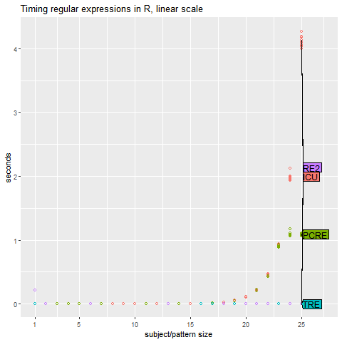
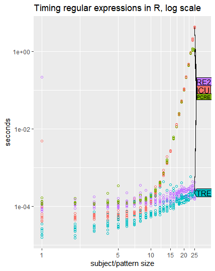

# Task 1

## environment setting

1. environment: windows 10
2. environment: [R 4.04 for Windows](https://cran.r-project.org/bin/windows/base/)
3. IDE: [R studio  1.4.1106](https://rstudio.com/products/rstudio/download/#download)

## package needed for run sample code

We need to install some packages and tools to run the sample code

1. install Rtools40

   To install package from github, we need to install new Rtools for R 4.0. This  package cannot be installed with `"install.packages()"`, so download the .exe file and install it following the instruction.

   1. download link : https://cran.r-project.org/bin/windows/Rtools/

2. install re2r

   There will be many warnings printed. Just ignore them and wait with patience. 

   ```R
   library(devtools)
   install_github("qinwf/re2r", build_vignettes = T)
   ```

3. install other packages with `install.packages`

   1. ```R
      install.packages("microbenchmark")
      install.packages("ggplot2")
      install.packages("directlabels")
      install.packages("stringi")
      ```

## sample code

```R
if(!require(re2r))devtools::install_github("qinwf/re2r", build_vignettes=FALSE, dep=FALSE)
if(!require(stringi))install.packages("stringi")

max.N <- 25
times.list <- list()
for(N in 1:max.N){
  cat(sprintf("subject/pattern size %4d / %4d\n", N, max.N))
  subject <- paste(rep("a", N), collapse="")
  pattern <- paste(rep(c("a?", "a"), each=N), collapse="")
  N.times <- microbenchmark::microbenchmark(
    ICU=stringi::stri_match(subject, regex=pattern),
    PCRE=regexpr(pattern, subject, perl=TRUE),
    TRE=regexpr(pattern, subject, perl=FALSE),
    RE2=re2r::re2_match(pattern, subject),
    times=10)
  times.list[[N]] <- data.frame(N, N.times)
}
times <- do.call(rbind, times.list)
save(times, file="times.RData")

library(ggplot2)
library(directlabels)

linear.legend <- ggplot()+
  ggtitle("Timing regular expressions in R, linear scale")+
  scale_y_continuous("seconds")+
  scale_x_continuous("subject/pattern size",
                     limits=c(1, 27),
                     breaks=c(1, 5, 10, 15, 20, 25))+
  geom_point(aes(N, time/1e9, color=expr),
             shape=1,
             data=times)
(linear.dl <- direct.label(linear.legend, "last.polygons"))
png("figure-complexity-linear.png")
print(linear.dl)
dev.off()

log.legend <- ggplot()+
  ggtitle("Timing regular expressions in R, log scale")+
  scale_y_log10("seconds")+
  scale_x_log10("subject/pattern size",
                limits=c(1, 30),
                breaks=c(1, 5, 10, 15, 20, 25))+
  geom_point(aes(N, time/1e9, color=expr),
             shape=1,
             data=times)
(log.dl <- direct.label(log.legend, "last.polygons"))
png("figure-complexity-log.png")
print(log.dl)
```


## result of benchmark



